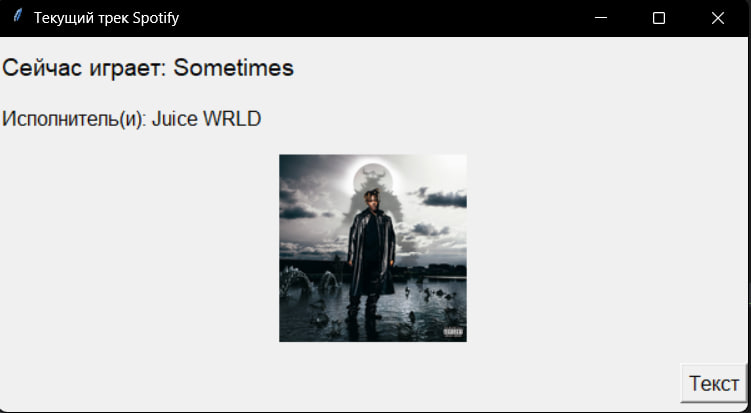

# Spotify Track Info

Это простое приложение на Python, которое отображает информацию о текущем играющем треке в Spotify и предоставляет текст песни с использованием Spotify API и Genius API.

## Установка

1. Установите необходимые зависимости, выполнив следующую команду: 

`pip install -r requirements.txt`

2. В файле `spotify_credentials.py` замените значения `CLIENT_ID` и `CLIENT_SECRET` на ваши собственные данные учетной записи Spotify.

3. Зарегистрируйте приложение в Spotify Developer Dashboard и получите свой Genius API токен. Замените значение `"YOUR_GENIUS_API_TOKEN"` в коде на ваш собственный токен Genius API.

## Использование

1. Запустите приложение, выполнив следующую команду:

`python main.py`

2. Откроется графическое окно, в котором будет отображаться информация о текущем играющем треке в Spotify.

3. Чтобы увидеть текст песни, нажмите кнопку "Текст". Откроется панель слева с текстом песни. Повторное нажатие на кнопку "Текст" скроет панель с текстом песни.

4. Чтобы закрыть приложение, закройте окно.

## Заметки

- Если трек не играет в Spotify или текст песни не найден на Genius, соответствующая информация будет отображаться.
- Обновление информации о треке происходит каждые 5 секунд.

## Лицензия

Этот проект распространяется под лицензией MIT. Подробности см. в файле `LICENSE`.

